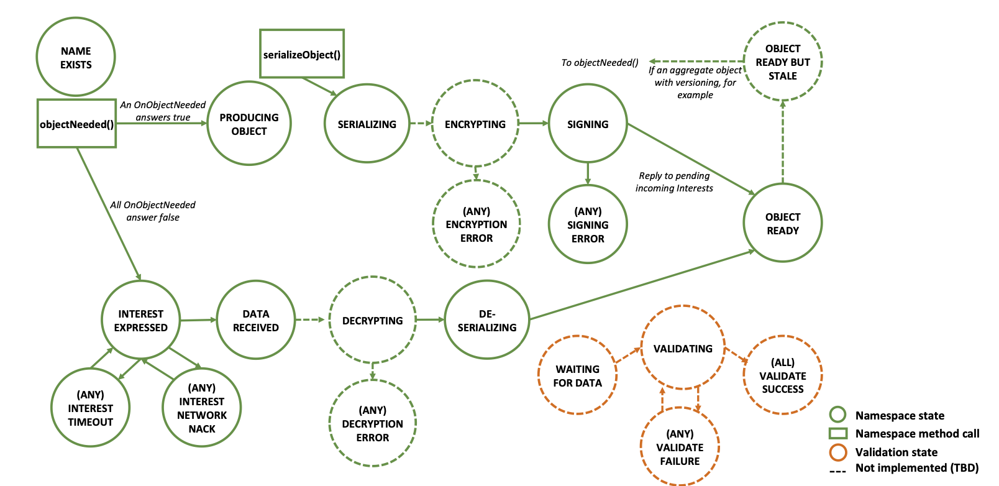

# How we name things

## Distributed Dataset Synchronization in Disruptive Networks
```text
/[group-prefix] := /application/instance
DataName := /[group-prefix]/[member-prefix]/[data-seq-number]
SyncInterestName := /<group-prefix>/<state-vector>/<timestamp>
```

API:
```text
produce(data)
onData(data)
```

## Lessons Learned Building a Secure Network Measurement Framework using Basic NDN
```text
CommandName := <domain><target>command<srcID><directive><timestamp>
ReplyName := <domain><target>reply<cmdID><dCnt><rSrcID><timestamp>

domain := <root>/dnmp
target := nod/<nodSpec>
nodSpec := all | local | <identity>
srcID := <roleType>/<ID>/<origin>
roleType := operator | user | guest
directive := <commandType>/<probeType>/<probeArgs>
commandType := probe
timestamp := <UTC microsec>(creation time)
cmdID := <srcID>/<directive>/<timestamp> (exact copy)
dCnt := <0> | <k|n> (exact one or kth out of n replies)
rSrcId := nod/<nodID>

Command signing chain:
cpub := <domain>/nod/<nodSpec>/command/<roleType>/<ID>/<origin>/probe/<pType>/<pArgs>/<timestamp>
roleCert := <domain>/<roleType>/<ID>/<_key>
dnmpCert := <domain>/<_key>
domain := <root>/dnmp
cpub <= roleCert <= dnmpCert <= netCert

Reply signing chain:
rpub := <cpub command => reply>/<dCnt>/<rSrcID><rtimestamp>
nodCert := <domain>/nod/<nodID>/<_key>
devCert := <domain>/device/<devID>/<_key>
configCert := <domain>/config/<configID>/<_key>
rpub <= nodCert <= devCert <= configCert <= netCert
```

Pub/sub API:
```text
Pub/Sub: publish(Publication&& pub); subscribeTo(Name&& topic, UpdateCb cb);
Upcall Config: setIsExpiredCb(IsExpiredCb cb); setFilterPubsCb(FilterPubsCb cb);
Security Config: setPubSecurity(PubSecurity&& ps); setPacketSecurity(PacketSecurity&& ps);

Pub/Sub methods access the communication functions of syncps.
Upcall config lets the shim control pub lifetime (IsExpiredCb) and delivery priority (FilterPubsCb) policies of syncps mechanisms.
Security config lets the shim supply the signing info and validator for pubs (PubSecurity) and NDN packets (PacketSecurity).
```

Command Pseudo-code:
```C++
//NOD Pseudocode
auto probeDispatch(Command c) {
  auto pType = c["probeType"];
  auto pArgs = c["probeArgs"];
  return (probeTable[pType])(pArgs);
}
string targets[] = {"nod/local","nod/all","nod/my_id"};
for (t: targets) {
  auto s = CRshim(t);
  s.waitForCmd(probeDispatch);
}
//Shell Utility Client Pseudocode
void processReply(const Reply& r) {
  cout << r << endl;
  exit(0);
}
int main(int argc, char∗ argv[]) {
  //... parse arguments
  try {
    CRshim s(target);
    s.replyTimeout(replyWait, doFinish);
    s.doCommand(ptype, pargs, processReply);
  } catch (const std::exception& e) {
    std::cerr << e.what() << std::endl;
  }
}
```

## Inter-Server Game State Synchronization using Named Data Networking
```text
/<app-pfx>/<game-pfx>/<macro-chunk-identifier>/<chunk-identifier>/<version>
```

## NDN-CNL: A Hierarchical Namespace API for Named Data Networking

Segmented object example:
```python
face = Face ()
image = Namespace("/foo/someimage/42") image.setFace(face)
def onSegmentedObject(handler , obj):
  print("Got image")
SegmentedObjectHandler(image, onSegmentedObject).objectNeeded()
```

Generalized object namespace:
```text
<object_prefix>/_meta
<object_prefix>/_manifest
<object_prefix>/<version>
```

Denetalized object metainfo:
```protobuf
// Compile this file using:
// protoc --python_out=. content-meta-info.proto

package ndn_message;

// Protobuf has no "outer" message type, so we need to put the TLV ContentMetaInfo
// message inside an outer "typeless" ContentMetaInfoMessage.
message ContentMetaInfoMessage {
  message ContentMetaInfo {
    required string content_type = 129;
    required uint64 timestamp = 130;
    required bool has_segments = 131;
    optional bytes other = 132;
  }

  // A ContentMetaInfoMessage has one ContentMetaInfo.
  required ContentMetaInfo content_meta_info = 128;
}
```

Generalized object producer:
```python
face = Face()
keyChain = KeyChain()
face.setCommandSigningInfo(keyChain, keyChain.getDefaultCertificateName())
objectPrefix = Namespace("/ndn/eb/run/28/description", keyChain)
objectPrefix.setFace(face,
  lambda prefixName: dump("Register failed for prefix", prefixName))
GeneralizedObjectHandler().setObject(
  objectPrefix, Blob("EB run #28. Ham and oats"), "text/html")
```

Generalized object consumer:
```python
face = Face ()
objectPrefix = Namespace("/ndn/eb/run/28/description")
objectPrefix.setFace(face)
objectPrefix.addOnValidateStateChanged(lambda ns, changedNS, state, ID: print(
  "Validate failure" if state == NamespaceValidateState.VALIDATE_FAILURE else ""))
def onGeneralizedObject(contentMetaInfo , objectNamespace):
  print("Got generalized object , content-type " +
        contentMetaInfo.contentType + ": " + str(objectNamespace.obj))
GeneralizedObjectHandler(objectPrefix , onGeneralizedObject).objectNeeded()
```

Generalized object stream namespace:
```text
<stream_prefix>/<seq>   -> Generalized objct
<stream_prefix>/_latest/<version #>
```

Simple wildcard example:
```python
applicationPrefix = Namespace(Name("/test/app/users"), keyChain)
applicationPrefix.setFace(face,
  lambda prefix: dump("Register failed for prefix", prefix))
applicationPrefix.enableSync() # Sync with other instances using this namespace
# Since the Namespace object childComponents is iterable, enumerate simply
regex = re.compile("Bob.*")
for child in filter(lambda c: regex.match(str(c)), applicationPrefix.childComponents):
  applicationPrefix[child].objectNeeded(True) # generate interests to retrieve
```



## NAC: Automating Access Control via Named Data

Names:
```text
KEK Name := /<access manager prefix>/NAC/<granularity>/KEK/<key-id>
KDK Name := /<access manager prefix>/NAC/<granularity>/KDK/<key-id>
EncryptedKDKDataName := KDK Name + /ENCRYPTED-BY/<decryptor prefix>/KEY/<decryptor key-id>
CK Name := /<producer prefix>/CK/<key-id>
CK Data Name = CK Name + /ENCRYPTED-BY + KEK Name

Data Name := /<producer prefix> + Other Components  (CK Name is hidden in the Content, not in the Name)
```

## Schematizing Trust in Named Data Networking

Name patterns:
- `<name>`: Match name component `name`
- `<>`: Match any single name component, i.e., wildcard
- `<name><>`: Match name component `name` followed by any single name component
- `<>*`: Match any sequence of name components
- `(...)`: Match pattern inside the brakets and assign it as an indexed sub-pattern
- `\n`: Reference to the n-th indexed sub-pattern
- `[func]`: Match (for authentication) or specialize (for signing) name component
  according to function `func` defined pattern, i.e., wildcard specializer
- `rule(arg1, ...)`: Derive a more specific name pattern from `rule`’s data name pattern with arguments `arg1`, ...

Example:
```text
RULE  DATA  KEY  DATA-EXAMPLE
article  (<>*)<blog><article><><><>  author(\1)  /a/blog/article/food/2015/1
author  (<>*)<blog><author>[user]<KEY>[id]  admin(\1)  /a/blog/author/Yingdi/KEY/22
admin  (<>*)<blog><admin>[user]<KEY>[id]  admin(\1) | root(\1)  /a/blog/admin/Alex/KEY/5

ANCHOR
root  (<>*)<blog><KEY>[id]  /a/blog/KEY/1
```

## Scalable Name-based Data Synchronization for Named Data Networking

Name:
```text
Data Stream Name := <producer-prefix>/<seq>
Sync Interest Name := /<routable-prefix>/psync/<SL>/<old-IBF>  {Hanging Interest}

Sync Data := /<routable-prefix>/psync/<SL>/<old-IBF>/<new-IBF>
    Content := {/<prefix1>/<version>, /<prefix2>/<version>}
```

## NDN-ABS: Attribute-Based Signature Scheme for Named Data Networking

Name:
```text
Public Parameters Data Name := <attr-auth-prefix>/ABS/42=pp/<version>
  e.g.: /campus/ABS/42=pp /_v=1  (Used to verify data under /campus)
KeyLocator Name := <name-of-authority-public-params>/42=policy/<claim-predicate-policy>
  e.g.: /campus/ABS/42=pp/_v=1/42=policy/student&2019
Attribute Secret Key Name := <name-of-authority-public-params>/42=secret/<version>/ENCRYPTED-BY/[user’s-RSA-key-or-ABE-policy]
  e.g.: /campus/ABS/42=secret/_v=24/ENCRYPTED-BY/[user-key]
```

Trust Schema Example:
```text
StudentRule  (<>*)<AR><video><><>  [@1]<ABS><><42=pp>[@{satisfy(“student”)}]
```

## Decentralized and Secure Multimedia Sharing Application over Named Data Networking

Name:
```text
UserPrefix := <Own Namespace From Network>/npChat/<username>
User Key Name := /<UserPrefix>/KEY/<KeyId>
Data Name := /<UserPrefix>/<>*

Friend Request := /<UserPrefix-DstUser>/friendRequest/<TrustType>/<CertName-SrcUser>
Friend Request Response := /<UserPrefix-DstUser>/friendRequest/<TrustType>/<CertName-SrcUser>/<CertName-DstUser>
```

## NDN-Lite
Pub/Sub:
```text
Identity Name := /<home-prefix>/<room>/<device-id>
Data Name := /<home-prefix>/<service-id>/DATA/<room>/<device-id>/<data-name>+
Command Name := /<home-prefix>/<service-id>/CMD/<scope>/<action>
scope := ø | <room> | <room><device-id>
Identity Key Name := /<home-prefix>/<service-id>/<room>/<device-id>/KEY/<key-id>
Encryption Key Name := /<home-prefix>/ACCESS/<EKEY or DKEY> /<Target-Service-ID>/<key-id>
Service Discovery := /<home-prefix>/SD/<desired-service>/<optional room>/<ANY or ALL>
```

Obsolete Service Discovery:
```text
SD Interest&Data Name: /<home-prefix>/AC/DKEY/SD (signed Interest)
Advertisement Interest: /<home-prefix>/SD/ADV/<location>+
Query Interest: /<home-prefix>/SD/<service-id>/<location>+/<descriptor = ANY or ALL>
```

## NDN-Repo
Put Data packets into Database with Key=Name

## ndn-mongo-fileserver
Name
```text
/ndn/test/README.md/<v=version>/<seg=segment>
```
Put Data packets into MongoDB with Key=Name

## RDR Protocol

Metadata
```text
Data Stream := /<prefix>+/<v=version>/<seg=segment>
Metadata Packet := /<prefix>+/32=metadata/<v=version>/<seg=segment>

Discovery Interest := /<prefix>+/32=metadata + CanBePrefix + MustBeFresh
```

Content
```xml
<Content>
  <ArbitraryElement>this is ignored</ArbitraryElement>
  <Name>/net/example/www/frontpage/%FD%97%47%1E%6D</Name>
  <Name>this is ignored</Name>
</Content>
```

API:
Current [ndn-tools](https://github.com/named-data/ndn-tools/tree/master/tools/chunks/catchunks) has
some pipelining algorithms.

## DLedger
Name
```text
/dledger/<creator>/<record hash>
```

API:
Can we design a better one?

## What's not here
- KITE: Not our business.
- Congestion Control: Not sure but may be not our business.

# Building Blocks
- Name Schema => CNL, RDR
- Data Fetching => Sync, Pub/Sub
- Verification => Schematized Trust, ABS
- Data Process => Access Control
- Storage => Local Repo (PacketStorage (auto), CustomStorage)
- Triggers => Sync, Pub/Sub
- Other High level API?

# Our system
TBD
